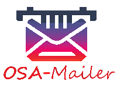

**Send dynamic and sophisticated E-mails using Smart Templates**

[Guidebook](https://dk26.github.io/osa-mailer/) |
[Discussions](https://github.com/DK26/osa-mailer/discussions)  

  

[Download Alpha 3 (i686-pc-windows)](https://github.com/DK26/osa-mailer/releases/tag/alpha-3)

## Features

- Currently supports 3 template engines: `tera`, `handlebars` and `liquid`
- Automatically attaches all your HTML resources to the SMTP message
- Provides you the ability to aggregate multiple E-mails of the same subject and recipients, into a single E-mail with accumulated context
- Supports multiple SMTP connection types: `NOAUTH`, `TLS` and `STARTTLS`

## Template Designing

Try the [`rendit` CLI tool](https://github.com/DK26/rendit)

## Supported Template Engines

| Name       | Short / File Extension | Version | Guide / Manual / Tutorial                                     |
| ---------- | ---------------------- | ------- | ------------------------------------------------------------- |
| Tera       | `tera`                 | v1.18.1 | <https://tera.netlify.app/docs/#templates>                    |
| Handlebars | `hbs`                  | v4.3.6  | <https://handlebarsjs.com/guide/>                             |
| Liquid     | `liq`                  | v0.26.1 | <https://github.com/Shopify/liquid/wiki/Liquid-for-Designers> |

## Quick Template Engines Guide

Tera (click to expand)

* Guide: <https://tera.netlify.app/docs/#templates>  
* Version: **v1.18.1**
* Repository: <https://github.com/Keats/tera>
* Alternatives: `Jinja2`, `Django`, `Liquid`, `Twig`
  
A highly advanced, capable and secure by default; rendering engine that follows the OWASP Top 10 guidelines.
A good alternative choice if you are used to template engines such as `Jinja2`, `Django`, `Liquid` or `Twig`. Originated in the Rust programming language.  

Handlebars (click to expand)

* Guide: <https://handlebarsjs.com/guide/>  
* Version: **v4.3.6**
* Repository: <https://github.com/sunng87/handlebars-rust>
* Alternatives: `Mustache`
  
A highly popular rendering engine that has been implemented across many programming languages. Considered to be somewhat more limited in features compared to the other engines. Originated in the Javascript programming language.

Liquid (click to expand)

* Guide: <https://github.com/Shopify/liquid/wiki/Liquid-for-Designers>  
* Version: **v0.26.1**
* Repository: <https://github.com/cobalt-org/liquid-rust>
* Alternatives: `smarty`
  
A highly advanced, capable and senior rendering engine, offering some optional security capabilities. A good alternative choice if you are used to the `smarty` template engine. Originated in the Ruby programming language.

## Prototype Note

This is still an MVP (Minimal Viable Product) and there is still work to be done and features to be added. Features may be added or removed later with no notice (but typically documented in the changelog notes of each release)

## License
MIT